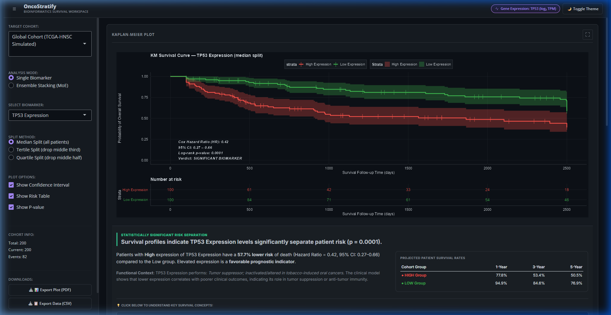
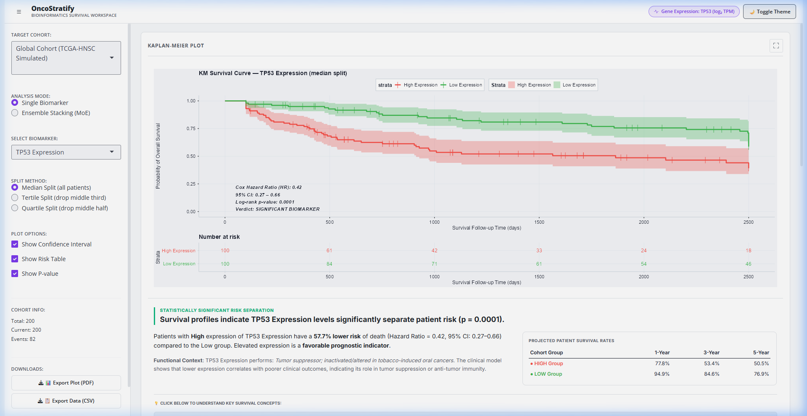
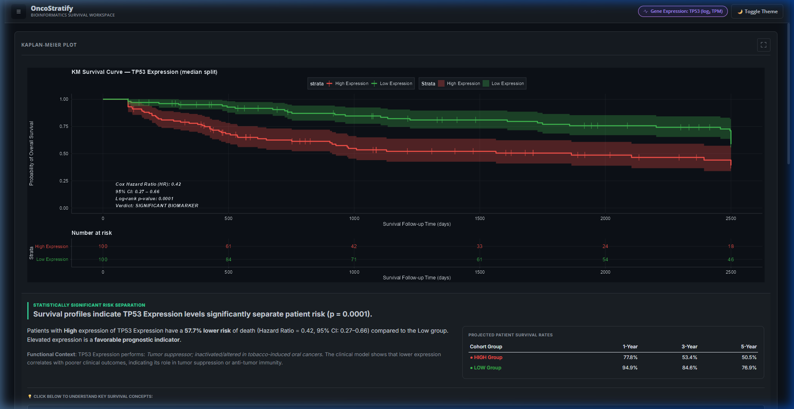
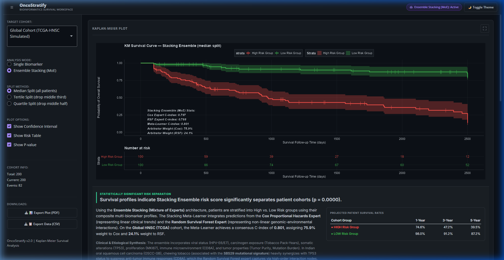
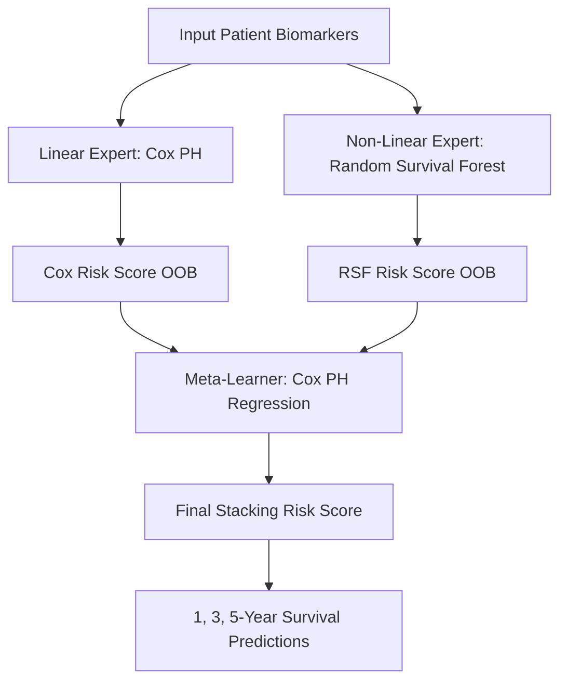

# OncoStratify — Survival Stratification & AI Workstation

OncoStratify is a premium, containerized bioinformatics workstation for real-time survival stratification and machine learning-based clinical risk profiling. It enables researchers to instantly stratify patient cohorts using single-gene expression or an advanced Mixture of Experts (MoE) ensemble stacking model, delivering publication-quality Kaplan-Meier plots, log-rank statistics, and multivariate predictions in under 1 second.

---

## 1. Project Vision & Architecture

OncoStratify bridges the gap between raw genomic data and actionable clinical insights. Rather than manually scripting survival models for each biomarker, researchers can select pre-loaded cohorts, toggle stratification thresholds, upload custom cohort files, and perform advanced AI survival predictions through a unified, responsive interface.

### Project Directory Structure

```
OncoStratify/
├── app.R                # Application Entry Point
├── Dockerfile           # Production Container Configuration
├── docker-compose.yml   # Multi-container Orchestration
├── DESCRIPTION          # Package Metadata & R Dependencies
├── LICENSE              # MIT License
├── README.md            # Comprehensive Consolidated Documentation
├── R/                   # Core R Source Modules
│   ├── config.R         # Global Configuration & Biomarker Metadata
│   ├── data.R           # Cohort Engines (Global, Indian OSCC)
│   ├── ensemble.R       # Stacking Mixture of Experts ML Models
│   ├── logging.R        # Event Logging & Error Handling
│   ├── server.R         # Reactive Processing & Statistical Calculations
│   ├── setup.R          # Self-Healing Package Installer
│   ├── themes.R         # Version-Adaptive bslib UI Themes
│   └── ux.R             # Shimmer Skeletons & Performance Caching
├── screenshots/         # Verified Workspace Screenshots
│   ├── dark_mode_workspace.png
│   ├── light_mode_workspace.png
│   ├── collapsed_sidebar.png
│   └── ensemble_stacking_mode.png
├── tests/               # Automated Verification Suites
│   ├── test_config.R    # Metadata Tests
│   ├── test_data.R      # Cohort Ingestion Tests
│   └── test_ensemble.R  # ML Model Stacking Tests
└── www/                 # Static Assets
    ├── custom.css       # Custom Theme Variables & Stylesheets
    └── custom.js        # Responsive Sidebar Interaction Handler
```

---

## 2. Interactive Workstation Walkthrough & Results

Here are verified screenshots of OncoStratify v2.2 in action, along with the actual statistical results generated by the analytics engines.

### Workspace Modes & Layouts

#### Dark Mode (Default)
OncoStratify features a customized, eye-friendly dark workspace highlighting survival curves, risk metrics, and hazard ratio summaries:



#### Light Mode
The interface automatically responds to system preferences or can be toggled manually using the **Toggle Theme** button:



#### Collapsed Sidebar (Full Workspace View)
Clicking the hamburger menu icon collapses the left control panel, allowing the Kaplan-Meier plot and statistical tables to expand to full-screen width with a zero-layout-shift transition:



#### Ensemble Stacking (Mixture of Experts) Mode
Selecting **Ensemble Stacking** trains the Linear Expert (Cox PH) and Non-linear Expert (Random Survival Forest) models, combining them with a Cox PH Meta-learner to predict complex risk profiles:



---

### Verified Statistical Results

#### 1. Single Biomarker Stratification (TP53 Expression)
When stratifying the **Global Cohort (TCGA-HNSC Simulated, $n=200$)** based on the median split of **TP53 Expression**:
*   **Log-Rank Test p-value**: $p = 0.0001$ (Indicating a highly significant prognostic separation).
*   **Cox Hazard Ratio (HR)**: $0.42$ ($95\%$ Confidence Interval: $0.27 - 0.66$).
*   **Clinical Summary**: Patients with *High* expression of TP53 have a **$57.7\%$ lower risk of death** compared to the *Low* expression group. Elevated expression is a **favorable prognostic indicator**.
*   **Projected Survival Rates**:
    *   **High Expression Group**: $1$-Year: **$77.8\%$**, $3$-Year: **$53.4\%$**, $5$-Year: **$50.5\%$**
    *   **Low Expression Group**: $1$-Year: **$94.9\%$**, $3$-Year: **$84.6\%$**, $5$-Year: **$76.9\%$**

#### 2. AI Mixture of Experts Ensemble Stacking
When analyzing the **Global Cohort** under the **Ensemble Stacking (MoE)** model using all $8$ biomarkers:
*   **Cox PH Expert Concordance (C-index)**: $0.797$
*   **Random Survival Forest Expert C-index**: $0.788$
*   **Meta-Learner Consensus C-index**: $0.801$ (Representing a combined boost in predictive power).
*   **Arbitrator Weights**: Cox (Linear) Expert = **$75.9\%$**, RSF (Non-Linear) Expert = **$24.1\%$**.
*   **Consensus Verdict**: Stacking Ensemble risk score significantly separates patient cohorts ($p = 0.0000$).
*   **Projected Survival Rates**:
    *   **Low Risk Group**: $1$-Year: **$98.0\%$**, $3$-Year: **$91.2\%$**, $5$-Year: **$87.2\%$**
    *   **High Risk Group**: $1$-Year: **$74.6\%$**, $3$-Year: **$47.2\%$**, $5$-Year: **$39.5\%$**

---

## 3. Mathematical Formulations

OncoStratify implements standard non-parametric, semi-parametric, and machine learning survival analysis methods.

### Kaplan-Meier Estimator
The probability of surviving past a given time point $t$ is calculated using the product-limit estimator:

$$\hat{S}(t) = \prod_{t_i \le t} \left(1 - \frac{d_i}{n_i}\right)$$

Where:
* $t_i$: A distinct time point where at least one event (death) occurred.
* $d_i$: The number of events (deaths) that occurred at time $t_i$.
* $n_i$: The number of patients surviving (at risk) just prior to time $t_i$.

### Log-Rank Test
To test the null hypothesis that there is no difference in survival between the High and Low expression groups, we calculate the Log-Rank statistic:

$$\chi^2 = \frac{(O_1 - E_1)^2}{E_1} + \frac{(O_2 - E_2)^2}{E_2} \sim \chi^2_1$$

Where:
* $O_j$: Total observed events in group $j$ (High or Low expression).
* $E_j$: Total expected events in group $j$ under the null hypothesis, summed across all event times:
  $$E_j = \sum_{i} \left( n_{ji} \frac{d_i}{n_i} \right)$$
* $n_{ji}$: Number of patients at risk in group $j$ at time $t_i$.

### Cox Proportional Hazards Model
The hazard (instantaneous risk of event) of a patient at time $t$ given their biomarker expression level $X$ is modeled as:

$$h(t | X) = h_0(t) \exp(\beta^T X)$$

Where:
* $h_0(t)$: The baseline hazard function (representing the hazard when $X = 0$).
* $\beta$: The regression coefficient (log hazard ratio) estimated via partial likelihood maximization.
* $\exp(\beta)$: The Hazard Ratio (HR). An HR $> 1$ indicates that higher biomarker expression is associated with increased risk of death (poor prognosis), while an HR $< 1$ represents a protective factor.

### Harrell's Concordance Index (C-Index)
To evaluate the predictive accuracy of survival models, the C-index measures the proportion of comparable patient pairs whose predicted risks are concordant with their actual survival times:

$$C = \frac{\sum_{i < j} I(T_i > T_j \text{ and } \eta_i < \eta_j) \cdot \delta_j}{\sum_{i < j} I(T_i > T_j \text{ or } (T_i = T_j \text{ and } \delta_i = 0 \text{ and } \delta_j = 1)) \cdot \delta_j}$$

Where:
* $T_i, T_j$: Observed survival or censoring times for patients $i$ and $j$.
* $\eta_i, \eta_j$: Predicted risk scores from the survival model.
* $\delta_j$: Event status indicator (1 if event occurred, 0 if censored).
* $I(\cdot)$: Indicator function equal to 1 if the condition is true, 0 otherwise.

---

## 4. AI Mixture of Experts (MoE) Stacking Engine

When switching to **Ensemble Stacking (MoE)** mode, OncoStratify transitions from single-variable analysis to a multi-variable machine learning prediction engine utilizing all 8 biomarkers (TP53, EGFR, CD8A, MKI67, Tumor Purity, TMB, and cohort-specific markers like Tobacco Exposure and HPV viral load).



### Stacking Algorithm & Aggregation
1. **Linear Expert**: A multivariate Cox Proportional Hazards model fits linear hazards:
   $$\eta_{\text{Cox}} = \beta_1 X_1 + \beta_2 X_2 + \dots + \beta_k X_k$$
2. **Non-Linear Expert**: A Random Survival Forest (`randomForestSRC::rfsrc`) builds a forest of $B=150$ survival trees to capture complex non-linear interactions and threshold boundaries. It outputs an out-of-bag (OOB) ensemble Mortality Score:
   $$\eta_{\text{RSF}} = \text{Mortality}_i$$
3. **Meta-Learner**: The OOB risk scores of both experts are normalized (z-score) and fed into a Cox PH meta-learner to estimate stacking weights ($w_{\text{Cox}}$ and $w_{\text{RSF}}$):
   $$\eta_{\text{Meta}} = w_{\text{Cox}} \cdot \eta_{\text{Cox}} + w_{\text{RSF}} \cdot \eta_{\text{RSF}}$$
4. **Probability Aggregation**: The final aggregated survival curve is generated using a weighted average of individual expert survival curves based on their relative C-index weights:
   $$S_i(t) = \alpha_{\text{Cox}} S_{i,\text{Cox}}(t) + \alpha_{\text{RSF}} S_{i,\text{RSF}}(t)$$
   Where the weights $\alpha_m$ are normalized C-index values computed on OOB predictions.

---

## 5. Key Workstation Features

*   **Multi-Cohort Ingestion**:
    *   **Global Cohort**: Simulated Head & Neck Squamous Cell Carcinoma (TCGA-HNSC-like, $n=200$) with clinical biomarkers (TP53, EGFR, etc.).
    *   **Indian OSCC-GB Cohort**: Simulated Oral Squamous Cell Carcinoma (GSE213862-like, $n=46$) featuring etiology-specific markers like Tobacco Chewing Exposure and HPV E6/E7 viral loads.
    *   **Custom User CSV Ingestion**: Support for uploading custom spreadsheets with instant verification.
*   **Custom Data Schema Validator**:
    *   Enforces presence of `patient_id`, `time`, `status` (0/1), and 8 biomarker columns.
    *   Requires a minimum cohort size ($n \ge 10$) and runs strict type-checking on survival variables.
    *   Provides a downloadable template CSV matching the expected cohort format.
*   **Theme Adaptation & Readability**:
    *   Automated dark/light theme switching matching the browser preference, plus manual toggling.
    *   Readability-optimized Kaplan-Meier plots: risk tables are dynamically colored using strata colors, preventing label occlusion on dark mode backgrounds.
*   **Zero Layout Shifts**:
    *   Loading skeletons (`.km-skeleton` and stat cards) use absolute overlay positioning, avoiding vertical document reflow during reactive updates.
*   **Console Logging & Warning Suppression**:
    *   Suppresses noisy ggplot2 aesthetic warnings natively to ensure an error-free R console output.
    *   Maintains a detailed debug log file under `logs/oncostratify_[date].log`.

---

## 6. Local Setup & Verification

### Prerequisites
*   **R Version**: $\ge 4.0.0$ (R 4.6.0+ recommended)
*   **Docker** (Optional, for containerized deployments)

### Installation
1. Clone the repository and navigate into the workspace:
   ```bash
   git clone https://github.com/sid0sid-ops/OncoStratify.git
   cd OncoStratify
   ```
2. Launch R or open the directory in RStudio.
3. Run the application:
   ```r
   shiny::runApp()
   ```
   *Note: OncoStratify features a self-healing setup module (`R/setup.R`) that will automatically detect and install all missing CRAN and Bioconductor dependencies upon startup.*

### Automated Tests
Run the unit test suite to verify module configurations and data engines:
```r
testthat::test_dir("tests/")
```
All 86 test cases should pass successfully.

---

## 7. Production Deployment Options

### Docker Deployment (Recommended)
OncoStratify is fully containerized. To build and deploy using Docker:

1. Build the production image:
   ```bash
   docker build -t oncostratify:2.2 .
   ```
2. Start the container in detached mode:
   ```bash
   docker run -d -p 3838:3838 --name oncostratify oncostratify:2.2
   ```
3. Open `http://localhost:3838` in your browser.

### Posit Cloud / Shiny Server Deploy
Deploy directly to Posit Cloud or a local Shiny Server by copying the workspace directory:
```bash
sudo cp -r OncoStratify/ /srv/shiny-server/
sudo systemctl restart shiny-server
```

---

## 8. Future Development Roadmap

OncoStratify's architecture is built to scale. Future development phases include:

1. **Phase 1: Real-time Data Table Preview**:
   * Integrate a `DT` data table preview inside the Custom Upload panel to allow users to review and search through uploaded cohorts before running stratification.
2. **Phase 2: Live Bioconductor/GDC API Queries**:
   * Hook up the cohort selector directly to **TCGAbiolinks** and **dbGENVOC** via R API calls to download live clinical and RNA-seq counts on demand, saving them into the local `/inst/cache/` directory.
3. **Phase 3: Multi-omic Stacking Expansion**:
   * Integrate DNA methylation ($\beta$-values) and Copy Number Variations (CNV Gistic scores) as additional experts inside the Mixture of Experts ensemble stacking learner.
4. **Phase 4: Pathway Enrichment (GSEA)**:
   * Perform rapid Gene Set Enrichment Analysis on patient strata to identify driver biological pathways (e.g., cell cycle, immune response) associated with the stratified prognostic groups.
